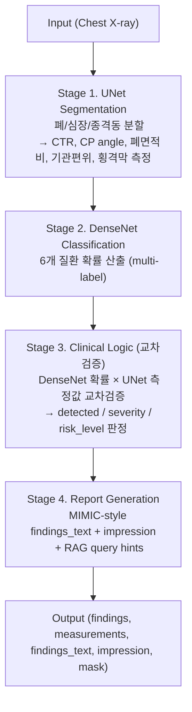

# Chest X-ray AI Analysis Service (chest-svc-v2)

흉부 X선 영상에서 6개 질환을 자동 탐지하고, MIMIC-CXR 방사선 판독문 스타일의 자연어 소견을 생성하는 의료 AI 분석 서비스입니다.

## Overview

UNet 세그멘테이션과 DenseNet 분류 모델을 교차검증하여 질환을 판별하고, 해부학적 측정값 기반으로 severity를 판정합니다. 결과는 MIMIC-CXR 판독문 형식(FINDINGS + IMPRESSION)으로 출력됩니다.



## 탐지 질환 (6개)

<table>
<tr><th>질환</th><th>교차검증 방식</th><th>UNet 측정값</th></tr>
<tr><td>Cardiomegaly (심비대)</td><td>DenseNet + UNet</td><td>CTR (심흉비)</td></tr>
<tr><td>Pleural Effusion (흉수)</td><td>DenseNet + UNet</td><td>CP angle (늑횡격막각)</td></tr>
<tr><td>Edema (폐부종)</td><td>DenseNet 단독</td><td>Cardiomegaly 동반 시 상향</td></tr>
<tr><td>Pneumothorax (기흉)</td><td>DenseNet + UNet</td><td>폐면적비 + 기관편위</td></tr>
<tr><td>Atelectasis (무기폐)</td><td>DenseNet + UNet</td><td>폐면적비</td></tr>
<tr><td>Enlarged Cardiomediastinum (종격동 확장)</td><td>DenseNet + UNet</td><td>종격동 폭</td></tr>
</table>

## MIMIC-style Report Output

모델 출력이 실제 방사선과 판독문과 동일한 형식으로 생성됩니다:

```
FINDINGS:
The cardiac silhouette is moderately enlarged with a cardiothoracic
ratio of 0.60. Bilateral perihilar pulmonary vascular congestion with
signs of severe pulmonary edema is noted. Right-sided volume loss with
ipsilateral tracheal deviation, suggestive of atelectasis versus
pneumonia. No pneumothorax is identified.

IMPRESSION:
1. Severe pulmonary edema. Clinical correlation with BNP recommended.
2. Moderate cardiomegaly (CTR 0.60). Echocardiography recommended.
3. Moderate atelectasis versus pneumonia (Right-sided volume loss with
   ipsilateral tracheal deviation). Clinical correlation recommended.
4. No pneumothorax.
```

## Severity 판정 기준

<table>
<tr><th>질환</th><th>Mild</th><th>Moderate</th><th>Severe</th></tr>
<tr><td>Cardiomegaly</td><td>CTR ≤ 0.55</td><td>0.55 ~ 0.60</td><td>&gt; 0.60</td></tr>
<tr><td>Pleural Effusion</td><td>CP각 ≤ 90°</td><td>90° ~ 120°</td><td>&gt; 120°</td></tr>
<tr><td>Edema</td><td>DenseNet ≤ 0.60</td><td>0.60 ~ 0.80</td><td>&gt; 0.80</td></tr>
<tr><td>Pneumothorax</td><td>DenseNet ≤ 0.60</td><td>0.60 ~ 0.80</td><td>&gt; 0.80</td></tr>
<tr><td>Atelectasis</td><td>폐면적 감소 ≤ 25%</td><td>25% ~ 40%</td><td>&gt; 40%</td></tr>
</table>

## 위험도 (Risk Level)

<table>
<tr><th>Level</th><th>조건</th></tr>
<tr><td><strong>CRITICAL</strong></td><td>긴장성 기흉 (기관 반대측 편위) 또는 Cardiomegaly severe + Edema 동반</td></tr>
<tr><td><strong>URGENT</strong></td><td>Pneumothorax 탐지 / Cardiomegaly severe / Edema severe / Pleural Effusion severe</td></tr>
<tr><td><strong>ROUTINE</strong></td><td>상기 해당 없음</td></tr>
</table>

## 벤치마크 성능

### Expert Dataset (2,411장)

<table>
<tr><th>질환</th><th>Sensitivity</th><th>Specificity</th><th>Youden J</th></tr>
<tr><td>Cardiomegaly</td><td>93.6%</td><td>82.9%</td><td>0.765</td></tr>
<tr><td>Pleural Effusion</td><td>90.7%</td><td>90.8%</td><td>0.815</td></tr>
<tr><td>Edema</td><td>80.2%</td><td>95.4%</td><td>0.756</td></tr>
<tr><td>Pneumothorax</td><td>90.6%</td><td>79.1%</td><td>0.697</td></tr>
<tr><td>Atelectasis</td><td>83.8%</td><td>81.6%</td><td>0.654</td></tr>
<tr><td>Enlarged CM</td><td>77.6%</td><td>86.0%</td><td>0.636</td></tr>
<tr><td><strong>Overall</strong></td><td><strong>86.7%</strong></td><td>—</td><td>—</td></tr>
</table>

### MIMIC Radiology Notes 대조 (102건 → 63명 판독문 매칭)

<table>
<tr><th>질환</th><th>Accuracy</th><th>Sensitivity</th><th>PPV</th><th>비고</th></tr>
<tr><td>Cardiomegaly</td><td><strong>85.3%</strong></td><td><strong>87.5%</strong></td><td><strong>96.6%</strong></td><td>CTR 교차검증 효과적</td></tr>
<tr><td>Pleural Effusion</td><td>70.0%</td><td>58.3%</td><td>87.5%</td><td>양성 정밀도 높으나 small effusion 놓침</td></tr>
<tr><td>Edema</td><td>60.9%</td><td>59.5%</td><td>88.0%</td><td>mild edema FN 15건</td></tr>
<tr><td>Enlarged CM</td><td>60.0%</td><td>63.6%</td><td>77.8%</td><td>GT 부족 (Unknown 48건)</td></tr>
<tr><td>Pneumothorax</td><td>59.2%</td><td>23.1%</td><td>23.1%</td><td>seg-assisted FP 10건</td></tr>
<tr><td>Atelectasis</td><td>58.5%</td><td>58.5%</td><td>100%</td><td>FN 22건 최다</td></tr>
<tr><td><strong>Overall</strong></td><td><strong>65.4%</strong></td><td>—</td><td>—</td><td></td></tr>
</table>

> 의학 용어 커버리지 60-91% (핵심 질환명 MIMIC 일치). 위치 정보 57% vs MIMIC 94% (lobe segmentation 미지원)

## Tech Stack

<table>
<tr><th>구분</th><th>기술</th></tr>
<tr><td>Backend</td><td>FastAPI + ONNX Runtime (CPU)</td></tr>
<tr><td>Models</td><td>UNet 세그멘테이션 (84MB) + DenseNet 분류 (28MB)</td></tr>
<tr><td>Frontend</td><td>React + Vite + Tailwind CSS + shadcn/ui</td></tr>
<tr><td>Inference</td><td>~150-300ms/image (CPU, M1 Mac 기준)</td></tr>
<tr><td>Output</td><td>MIMIC-style findings_text + impression (English)</td></tr>
</table>

## 폴더 구조

```
chest-svc-pre/
├── main.py                     # FastAPI 서버 (CORS, 정적서빙, /predict)
├── pipeline.py                 # 3-Stage 파이프라인 오케스트레이션
├── config.py                   # 환경변수 설정 (MODEL_DIR, LOG_LEVEL)
├── thresholds.py               # 임계값 중앙 관리 (DenseNet, CTR, CP angle 등)
├── requirements.txt            # Python 의존성
├── Dockerfile                  # 컨테이너 빌드
│
├── layer1_segmentation/        # Stage 1: UNet ONNX 추론 + 해부학 측정
│   ├── model.py                #   세그멘테이션 + CTR/CP/폐면적비 계산
│   └── preprocessing.py        #   이미지 전처리 (320x320 리사이즈)
│
├── layer2_classification/      # Stage 2: DenseNet ONNX 추론
│   └── densenet.py             #   6개 질환 확률 산출
│
├── layer3_clinical_logic/      # Stage 3: 교차검증 + MIMIC-style 판독문 생성
│   └── engine.py               #   DenseNet×UNet 교차검증 → severity/risk
│                               #   + findings_text, impression, rag_query_hints
│
├── shared/
│   └── schemas.py              # Pydantic 요청/응답 스키마
│
├── models/                     # ONNX 모델 파일 (113MB)
│   ├── unet.onnx + .data       #   UNet 세그멘테이션 (84MB)
│   └── densenet.onnx + .data   #   DenseNet 분류 (28MB)
│
├── test-images/                # 시연용 테스트 이미지 (31장)
│
└── frontend/                   # React 테스트 UI
    ├── src/app/
    │   ├── App.tsx              #   메인 레이아웃
    │   ├── api.ts               #   /predict API 클라이언트 + 응답 변환
    │   └── components/
    │       ├── SummaryBar.tsx    #   FINDINGS + IMPRESSION 판독 결과 영역
    │       ├── DiseaseCard.tsx   #   질환 카드 (evidence + verification 상세)
    │       ├── ImageViewer.tsx   #   X-ray 뷰어 + 세그멘테이션/측정선 오버레이
    │       └── ...
    └── vite.config.ts           #   Vite + API 프록시 설정
```

## 실행 방법

### 1. Python 의존성 설치

```bash
cd chest-svc-pre
pip install -r requirements.txt
```

### 2. 백엔드 서버 시작

```bash
MODEL_DIR=./models python -m uvicorn main:app --host 0.0.0.0 --port 8000
```

### 3. 프론트엔드 시작 (별도 터미널)

```bash
cd frontend
npm install
npm run dev
```

### 4. 브라우저에서 접속

```
http://localhost:5173
```

## API

### `POST /predict`

```bash
curl -X POST http://localhost:8000/predict \
  -H "Content-Type: application/json" \
  -d '{
    "patient_id": "TEST-001",
    "patient_info": {"age": 50, "sex": "M", "chief_complaint": "chest X-ray"},
    "data": {"image_base64": "<base64-encoded-image>"}
  }'
```

### Response 구조

```json
{
  "status": "success",
  "modal": "chest",
  "findings": [
    {
      "name": "Cardiomegaly",
      "detected": true,
      "confidence": 0.857,
      "severity": "moderate",
      "recommendation": "Echocardiography recommended",
      "verification": {"densenet": true, "unet_metric": "ctr", "unet_value": 0.60, "unet_confirmed": true},
      "evidence": ["CTR 0.5976 (>0.5)", "DenseNet 0.86 (>0.55)"],
      "impression_text": "Moderate cardiomegaly (CTR 0.60)"
    }
  ],
  "summary": "1. Moderate cardiomegaly (CTR 0.60). Echocardiography recommended.\n2. ...",
  "findings_text": "The cardiac silhouette is moderately enlarged with a cardiothoracic ratio of 0.60. ...",
  "impression": "1. Moderate cardiomegaly (CTR 0.60). Echocardiography recommended.\n2. ...",
  "measurements": {"ctr": 0.5976, "lung_area_ratio": 1.348, "...": "..."},
  "rag_query_hints": ["moderate cardiomegaly ctr 0.60", "severe edema"],
  "risk_level": "urgent",
  "metadata": {
    "view": "PA",
    "total_time_ms": 385,
    "mask_base64": "<segmentation-mask-png>"
  }
}
```

### 기타 엔드포인트

<table>
<tr><th>Method</th><th>Path</th><th>설명</th></tr>
<tr><td><code>GET</code></td><td><code>/healthz</code></td><td>Liveness probe</td></tr>
<tr><td><code>GET</code></td><td><code>/readyz</code></td><td>Readiness probe (모델 로드 확인)</td></tr>
<tr><td><code>GET</code></td><td><code>/test-cases</code></td><td>테스트 이미지 목록</td></tr>
</table>

## 측정선 오버레이

프론트엔드 이미지 뷰어에서 토글 가능한 측정선 오버레이:

<table>
<tr><th>측정선</th><th>색상</th><th>설명</th></tr>
<tr><td>심장폭</td><td><code>#FF4444</code> 빨강</td><td>CTR 심장 최대폭</td></tr>
<tr><td>흉곽폭</td><td><code>#4488FF</code> 파랑</td><td>CTR 흉곽 최대폭</td></tr>
<tr><td>종격동</td><td><code>#FFD700</code> 노랑</td><td>종격동 폭 측정</td></tr>
<tr><td>기관 중심</td><td><code>#AA66FF</code> 보라</td><td>기관 편위 표시</td></tr>
<tr><td>CP angle</td><td><code>#44BB44</code> / <code>#FF8800</code></td><td>늑횡격막각 (정상/이상)</td></tr>
<tr><td>횡격막</td><td><code>#66CCFF</code> 하늘</td><td>좌우 돔 + 높이차</td></tr>
</table>
