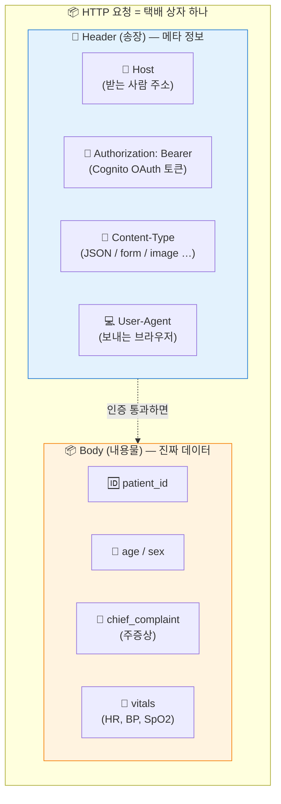
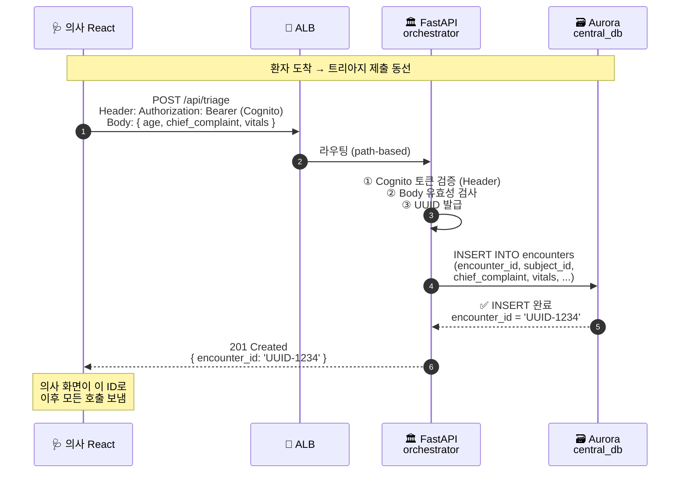

# 🎒 백엔드 기초 101 — 우리 코드로 이해하는 HTTP 통신

> 📚 **과목**: Emergency Multimodal Diagnostic Orchestrator (say-6)
> 👩‍🏫 **담당**: 세상에서 가장 친절한 백엔드 기초 강의
> 🎯 **대상**: 코딩 처음 하시는 분 / 비전공자 / "POST가 뭐예요?" 부끄러워서 못 묻는 분
> ⏰ **선수 학습 없음** — 이게 출발선
> 📌 **이 수업 끝나면**: 우리 시스템의 실제 엔드포인트(`POST /api/triage`, `GET /encounters/{id}`, UPSERT 등)를 보고 "아, 얘가 뭐 하는 친구구나" 즉시 파악 + 메서드·멱등성·상태 코드까지 한 번에 정리

---

## 🌱 들어가며 — "백엔드"라는 단어부터 분해

처음 들으면 외계어인 "백엔드". 일단 단어부터 풀어봅시다.

```
🍽️ 식당에 가면 두 공간이 있어요:
   ├─ 손님이 보는 홀  (테이블, 메뉴판, 점원)  ← 프론트엔드
   └─ 손님이 못 보는 주방 (요리사, 냉장고, 식재료) ← 백엔드
```

| 영역 | 사용자가 보나? | 우리 시스템에서는 |
|------|---------------|------------------|
| **프론트엔드** | ✅ 직접 보고 누름 | React 데스크탑 웹 + Flutter 모바일 앱 |
| **백엔드** | ❌ 안 보임 | FastAPI 서버 + Aurora DB + S3 + AI 모달 |

오늘은 이 **"안 보이는 주방"** 이 어떻게 손님(프론트엔드)과 대화하는지, 그 대화의 가장 기본 규칙을 배웁니다.

---

## 🏥 1. 백엔드의 기본 원칙 — 요청과 응답

### 1.1 환자/의사 ↔ 원무과의 비유

종합병원의 원무과 창구를 떠올려보세요.

| 병원 | 우리 시스템 |
|------|------------|
| 🩺 **환자 / 의사** — 요청하러 오는 사람 | **클라이언트** — React 웹·Flutter 앱 |
| 🏛️ **원무과 창구** — 받아서 처리해주는 곳 | **서버** — FastAPI 백엔드 |

```
🩺 환자: "접수 좀 해주세요!"          ← 요청 (Request)
🏛️ 원무과: "네, 접수증 발급해드릴게요."  ← 응답 (Response)
```

**이게 클라이언트-서버 모델의 전부예요.** 진짜 끝.

### 1.2 절대 규칙 — "요청 없으면 응답 없다"

**서버는 절대로 먼저 말 걸지 않습니다.**

```
🏛️ 원무과 직원은 환자가 안 와도 차트를 미리 만들어두지 않아요.
    환자가 와서 "접수해주세요" 라고 말해야 비로소 새 차트를 만듭니다.
    환자가 부르기 전엔 그냥 자리에 앉아서 대기.
```

이게 백엔드의 **절대 규칙**:

> ⚠️ **The Rule**: 클라이언트의 **요청(Request)이 없으면** 서버의 **응답(Response)도 없다**.

서버 입장에서 보면:
- 24시간 켜져있지만, 사실은 "**listening**" — 귀만 열어놓고 있음
- 클라이언트가 부르면 그때서야 깨어남
- 처리 끝나면 다시 listening 상태로

이 규칙 때문에 **백엔드는 클라이언트를 먼저 부를 수 없어요.** (그래서 "결과가 도착했음을 알리는" 실시간 푸시는 WebSocket·FCM 같은 특수 도구가 따로 필요한 거예요. 마지막 퀴즈에 나옵니다 ⭐)

### 1.3 우리 시스템 전체 그림

```
┌──────────────────────┐                            ┌──────────────────────┐
│   클라이언트 (Client)  │  ──── 요청 (Request) ────→  │     서버 (Server)     │
│                      │                            │                      │
│ 🩺 React 데스크탑      │                            │ 🏛️ FastAPI Backend   │
│ 📱 Flutter 모바일      │                            │   ├─ Aurora DB        │
│                      │                            │   ├─ S3 (이미지/파형)   │
│                      │  ←─── 응답 (Response) ────  │   └─ AI 모달 3종       │
└──────────────────────┘                            └──────────────────────┘

           ↑ 환자/의사                                      ↑ 원무과·중앙통제실
```

---

## 📦 2. HTTP 요청의 두 얼굴 — Header와 Body

클라이언트와 서버가 대화할 때는 **HTTP** 라는 약속된 형식을 씁니다. 가장 중요한 건 요청이 두 부분으로 나뉜다는 점.

### 2.1 택배 상자 비유

```
   ┌─────────────────────────────────┐
   │ 📝 송장 (Header)                  │  ← 누가 어디로 보냈는지, 어떤 종류인지
   │ ───────────────────────────────── │
   │                                  │
   │   📦 내용물 (Body)                │  ← 실제로 받아서 처리할 진짜 데이터
   │                                  │
   └─────────────────────────────────┘
```

**핵심**: 한 상자(요청) 안에 **송장(Header) + 내용물(Body)** 이 같이 들어있습니다.

### 2.2 Header (송장) 에 들어가는 것

택배 상자 겉면의 송장에 뭐가 적혀있나요? 거기서 영감을 얻으면 됩니다.

| 송장 항목 | HTTP Header 의 예 | 의미 |
|----------|-------------------|------|
| 보내는 사람 정보 | `User-Agent: Mozilla/5.0 ...` | 어떤 브라우저·앱에서 왔는지 |
| 받는 사람 주소 | `Host: api.say-6.com` | 어느 서버로 가는지 |
| 내용물 종류 | `Content-Type: application/json` | "이 안엔 JSON이 들어있어요" |
| 본인 인증·서명 | `Authorization: Bearer eyJraW...` | 🔑 **누가 보냈는지 신원 증명** |

**가장 중요한 건 인증 토큰** 줄이에요. 택배 기사가 본인 확인할 때 신분증 보는 것처럼, 서버도 "이 요청이 누구한테서 온 건지" 확인합니다.

### 2.3 Body (내용물) 에 들어가는 것

```
의사가 트리아지를 제출한다고 합시다. Body에는 진짜 환자 정보가 들어가요:
```

```json
{
  "patient_id": "P001",
  "age": 67,
  "sex": "M",
  "chief_complaint": "가슴이 아프고 진땀이 남",
  "vitals": {
    "heart_rate": 95,
    "blood_pressure": "140/85",
    "spo2": 96
  }
}
```

### 2.4 우리 시스템의 실제 HTTP 요청

`POST /api/triage` 요청이 실제로 어떻게 생겼는지 보겠습니다:

```http
POST /api/triage HTTP/1.1                          ← ① 어디로 / 어떤 메서드
Host: api.say-6.com                                ← ② Header 시작
Content-Type: application/json
Authorization: Bearer eyJraWQiOiJ...               ← 🔑 Cognito 토큰 (의사 신원)
User-Agent: Mozilla/5.0 ...

{                                                   ← ③ Body 시작
  "patient_id": "P001",
  "age": 67,
  "chief_complaint": "흉통",
  "vitals": { "heart_rate": 95, "blood_pressure": "140/85" }
}
```

### 2.5 그림 1 — Header/Body 구조 (Mermaid 코드 — 노션에 그대로 붙여넣기 가능)



### 2.6 왜 Cognito 토큰은 Header에, 환자 데이터는 Body에?

> 🤔 "다 한 군데에 넣어버리면 안 되나요?"

좋은 질문입니다. 분리하는 데는 이유가 있어요.

| 구분 | Header (송장) | Body (내용물) |
|------|---------------|---------------|
| **목적** | 누가·어떤 종류로 보냈는지 | 실제 처리할 데이터 |
| **크기** | 작음 (수백 바이트) | 큼 (KB ~ MB) |
| **검사 시점** | 서버가 **가장 먼저** 검사 | 인증 통과 후 처리 |
| **Cognito 토큰** | ✅ Header → 매 요청마다 자동 첨부 | ❌ Body엔 안 넣음 |
| **환자 데이터** | ❌ Header엔 못 들어감 | ✅ Body |

**현실 비유**:
- 🏥 병원 출입증(Cognito 토큰)은 **목에 걸고 다님** → Header (입구에서 가장 먼저 확인)
- 진료받을 환자 차트는 **봉투에 넣어서 손에 들고 감** → Body (안에서 펼쳐 보는 내용)
- 출입증을 봉투 속에 숨겨두면? 입구 경비원이 못 보고 막아버림.

```
🩺 React 앱이 요청 보낼 때 자동으로 두 가지를 합칩니다:

  Header: Authorization: Bearer <Cognito 토큰>    ← 로그인 시 받은 토큰
  Body:   { 환자 인적사항 + 바이탈 ... }            ← 의사가 폼에 입력한 데이터
```

### 2.7 보안 한 줄

> ⚠️ **HTTPS 필수**: Authorization 토큰이 든 Header는 반드시 **암호화된 통로(HTTPS)** 로만 보내야 됩니다. HTTP(평문)로 보내면 중간에서 토큰을 가로채여 누가 의사인 척 할 수 있어요. 그래서 우리 시스템은 CloudFront → ALB → ECS 전 구간 HTTPS.

---

## 🎬 3. HTTP 메서드 3종 — 우리 시스템 엔드포인트로 배우기

택배 상자를 보낼 때 "신규 발송인지 / 회수인지 / 반품인지" 표시해야 우체국이 어떻게 처리할지 알 수 있죠. HTTP에도 똑같이 **메서드(Method)** 가 있습니다.

가장 많이 쓰는 3종:

| 메서드 | 의미 | 병원 행위 | DB 액션 |
|--------|------|----------|---------|
| **POST** | Create / 명령 | 🆕 신규 접수증 발행, 검사 실행 명령 | INSERT |
| **GET** | Read / 조회 | 📖 기록실 차트 꺼내보기 | SELECT |
| **PUT / UPSERT** | Update / 덮어쓰기 | ✏️ 차트 위에 새 결과 덮어쓰기 | UPDATE (없으면 INSERT) |

### 3.1 POST — "새로 만들거나, 실행해주세요"

POST는 **두 가지 의미**로 쓰입니다:
- **Create**: 새 자원 만들기 (DB에 새 row INSERT)
- **명령**: "이거 실행해주세요" 같은 동작 트리거

우리 시스템엔 POST 엔드포인트가 3개 있어요. 각각 어떻게 다른지 봅시다.

#### 🆕 `POST /api/triage` — 신규 환자 접수증 발행 (Create)

```
🩺 의사: [트리아지 제출] 버튼 클릭
              ↓
        Body: { age, chief_complaint, vitals }
              ↓
   🏛️ FastAPI orchestrator:
        ① Header의 Cognito 토큰 검증
        ② Body 데이터 유효성 검사
        ③ DB에 새 row INSERT:

            INSERT INTO encounters (
                encounter_id, subject_id, chief_complaint, vitals, ...
            ) VALUES (
                'UUID-1234', 'P001', '흉통', {...}, ...
            );

        ④ 응답: 201 Created + { encounter_id: 'UUID-1234' }
```

**병원 비유**: 환자가 처음 도착해서 원무과에 "접수해주세요" 라고 말 → 직원이 새 접수증을 만들어서 환자번호 발급.

#### ⚡ `POST /orders/{sr_id}/approve` — 검사 실행 명령

```
🩺 의사: "이 환자 CXR 검사하라고!" (AI 권고 카드의 [승인] 버튼)
              ↓
        POST /orders/sr-9999/approve
              ↓
   🏛️ orchestrator:
        ① ServiceRequest 상태 변경 (draft → active)
        ② CXR 모달에 base64 페이로드 전달
        ③ 비동기로 모달 분석 시작
        ④ 응답: 202 Accepted (실행은 백그라운드에서 진행 중)
```

**병원 비유**: 의사가 "X-ray실에 환자 보내!" 하고 명령. 영상의학과가 검사 시작.

#### 🧠 `POST /reports/{enc_id}/generate` — Bedrock 깨우기

```
🩺 의사: "모든 검사 완료. 종합 소견서 만들어줘"
              ↓
        POST /reports/UUID-1234/generate
              ↓
   🏛️ orchestrator:
        ① 3개 모달 결과 + RAG 유사 케이스 수집
        ② Bedrock Claude Haiku 4.5 (critical 시 Sonnet 4.6)에 종합 판독 요청 (약 8초)
        ③ diagnostic_reports 테이블에 INSERT
        ④ WebSocket으로 "report_generated" 이벤트 푸시
```

**병원 비유**: "베테랑 교수님께 케이스 의뢰합니다. 종합 소견 부탁드려요."

#### POST의 3가지 특징

```
1. DB에 새 row가 생긴다 (INSERT)
2. 호출할 때마다 → 새거 만들어짐 (중요!)
3. URL에 ID가 없거나, "어떤 자원에 대한 명령" 형태 (/api/triage, /orders/{id}/approve)
```

### 3.2 GET — "기존 차트 좀 꺼내봐주세요"

GET은 **순수하게 읽기만**. DB에 손 안 댐.

#### 📋 `GET /encounters/{id}` — 환자 차트 조회

```
🩺 의사: [환자 상세 페이지] 진입
              ↓
        GET /encounters/UUID-1234
              ↓
   🏛️ orchestrator:
        ① Cognito 토큰 검증
        ② DB SELECT:

            SELECT * FROM encounters
            WHERE encounter_id = 'UUID-1234';

        ③ 응답: 200 OK + { 환자 정보 ... }
```

**병원 비유**: 기록실에 가서 "P001 환자 차트 좀 꺼내주세요" → 직원이 그대로 꺼내서 보여줌. **차트 내용은 안 바뀜.**

#### 🕒 `GET /encounters/{id}/timeline` — 진료 진행 타임라인

```
🩺 의사: [Exam Progress 사이드 패널] 갱신
              ↓
        GET /encounters/UUID-1234/timeline
              ↓
   🏛️ orchestrator:
        ① DB SELECT:

            SELECT event_type, payload, created_at
            FROM modal_events
            WHERE encounter_id = 'UUID-1234'
            ORDER BY created_at DESC;

        ② 응답: 200 OK + [ 이벤트 로그 N개 ]
```

**병원 비유**: "이 환자 오늘 어떤 검사들 거쳐왔어요?" → 기록실이 진료 흐름 출력해서 보여줌.

#### GET의 3가지 특징

```
1. DB 변화 없음 (SELECT만)
2. 100번 호출해도 결과가 같음 ⭐ (멱등성 — 다음 챕터!)
3. URL에 식별자나 쿼리 파라미터 (/encounters/{id}, ?status=open)
```

### 3.3 PUT / UPSERT — "이 자리에 최신 결과 덮어써주세요"

PUT은 **"있으면 갱신, 없으면 생성"** 의미로 자주 씁니다. 우리 시스템에선 PostgreSQL의 **UPSERT** 패턴(`INSERT ... ON CONFLICT ... DO UPDATE`) 으로 구현돼있어요.

#### 🩺 `modal_results` 적재 — AI 추론 결과 저장

```python
# AI 모달이 분석 끝낸 뒤 orchestrator가 DB에 저장하는 SQL
INSERT INTO modal_results (encounter_id, modality, raw_response, risk_level)
VALUES ('UUID-1234', 'ECG', '{...새 결과...}', 'critical')

ON CONFLICT (encounter_id, modality)         ← 같은 (encounter, ECG) 조합이 이미 있으면
DO UPDATE
   SET raw_response = EXCLUDED.raw_response,  ← 새 값으로 덮어씀
       risk_level   = EXCLUDED.risk_level,
       updated_at   = NOW();
```

읽어보면:
```
"UUID-1234 + ECG" 조합으로 새 row 만들려고 해봐.
   ├─ ✅ 이미 있으면 → 새 값으로 덮어써 (UPDATE)
   └─ ❌ 없으면      → 새로 만들어 (INSERT)
```

이게 **UPSERT** (UPDATE + INSERT).

#### 병원 비유

```
🗒️ 기록실 직원: "환자 UUID-1234의 ECG 차트 페이지에 새 결과 받았습니다."
   ├─ 페이지 이미 있음 → 새 결과로 페이지 갱신 ✏️
   └─ 페이지 없음     → 새 페이지 추가하고 결과 기록 🆕
```

#### UPSERT 의 3가지 특징

```
1. URL에 "어느 자리에 덮어쓸지" 명확히 지정
   (encounter_id + modality 조합이 자리 표시)
2. 10번 호출해도 결과가 1개의 최신 row로 수렴 ⭐ (멱등성)
3. PostgreSQL의 ON CONFLICT 절이 이 자동 분기를 가능하게 함
```

### 3.4 한눈에 비교

```
                 POST              GET              PUT/UPSERT
                  ↓                 ↓                   ↓
              새 row 만들거나    기존 row 보기      그 자리에 덮어쓰기
              명령 실행

DB 액션        INSERT             SELECT             INSERT ... ON CONFLICT
                                                     DO UPDATE
N번 호출 시     N개 row 생김       변화 없음          1개 최신 row로 수렴

우리 시스템    POST /api/triage   GET /encounters/   modal_results 적재
              POST /orders/.../  {id}               (AI 결과 저장)
                approve          GET /.../timeline
              POST /reports/.../
                generate

멱등성          ❌                 ✅                  ✅
```

### 3.5 그림 2 — 트리아지 등록 시퀀스 다이어그램 (Mermaid)



---

## ⭐ 4. 가장 많이 틀리는 핵심 개념 — 멱등성 (Idempotency)

여기가 오늘 수업의 **가장 중요한 부분**입니다. 면접에서도 자주 나와요.

### 4.1 멱등성이 뭔데?

> 📖 **멱등성(Idempotency)**: 같은 요청을 **여러 번 보내도** 시스템 상태와 결과가 **한 번 보낸 것과 같은** 성질.

복잡해 보이지만 한 줄로:

> "같은 버튼 5번 눌러도 결과 똑같으면 멱등, 다르면 멱등 아님."

### 4.2 메서드별 멱등성 표

| 메서드 | 멱등? | 이유 |
|--------|------|------|
| **POST** | ❌ 안 멱등 | 호출할 때마다 **새 row** 가 생기니까 |
| **GET** | ✅ 멱등 | 읽기만 함, DB 변화 없음 |
| **PUT / UPSERT** | ✅ 멱등 | "그 자리에 덮어쓰기"라 N번이든 1번이든 최종 상태 동일 |
| **DELETE** | ✅ 멱등 | 한 번 지우면 끝, N번 더 지워도 똑같이 없음 |

### 4.3 시나리오 ① — POST가 멱등하지 않아서 생기는 사고

```
[상황] 응급실 와이파이가 불안정. 의사가 트리아지 [제출] 버튼 누름.
       3초 동안 응답이 안 옴.
       의사: "어, 안 됐나?" 다시 누름. 또 안 옴. 한 번 더 누름.
       → 결국 [제출] 버튼을 3번 클릭.

[실제로 일어난 일]
   클릭 1 → POST /api/triage → 백엔드 도착했지만 응답이 늦게 옴
   클릭 2 → POST /api/triage → 또 도착
   클릭 3 → POST /api/triage → 또 도착

[DB 상태]
   INSERT INTO encounters VALUES (encounter_id='UUID-A', ...);  ← 클릭 1
   INSERT INTO encounters VALUES (encounter_id='UUID-B', ...);  ← 클릭 2
   INSERT INTO encounters VALUES (encounter_id='UUID-C', ...);  ← 클릭 3

[결과]
   ❌ 같은 환자 방문이 DB에 3건 등록됨
   ❌ 모달 호출도 3번 발생 → AI 추론 비용 3배
   ❌ 의사 화면엔 "환자 카드" 3개 떠서 혼란
```

**이게 POST의 비멱등성이 일으키는 사고**입니다.

#### 대응 방법

1. **프론트엔드에서 더블 클릭 방지**: 한 번 누르면 버튼 비활성화 5초
2. **클라이언트가 Idempotency Key 전송**: `Idempotency-Key: abc-123` Header로 같이 보내서, 백엔드가 "이 키 이미 처리했나?" 확인
3. **재시도 가능한 정상 응답을 빠르게**: 응답이 1초 안에 가면 의사가 재클릭 안 함

우리 시스템은 1번 방법(버튼 비활성화) 으로 막고 있지만, 본질적으로 POST는 위험합니다.

### 4.4 시나리오 ② — UPSERT가 멱등해서 안전한 이유

```
[상황] AI 모달 추론 결과를 DB에 저장하려는데 네트워크 일시 끊김.
       내부 재시도 워커가 같은 결과를 10번 재전송 시도.

[각 재시도 시점의 SQL]
   재시도 1: INSERT ... ON CONFLICT (encounter_id, modality) DO UPDATE ...
             → 이때 처음이라 INSERT 성공
   재시도 2: 같은 SQL 또 실행
             → 같은 (encounter_id='UUID-1234', modality='ECG') 조합 이미 있음
             → ON CONFLICT 분기 발동 → UPDATE (같은 값으로 덮어씀)
   재시도 3 ~ 10: 모두 똑같이 UPDATE (값이 같으니 사실상 변화 없음)

[DB 최종 상태]
   ✅ modal_results 테이블에 (UUID-1234, ECG) row 딱 1개
   ✅ 그 row의 값은 최신 ECG 추론 결과 1개
   ✅ 10번 재시도해도 깔끔하게 한 줄
```

**이게 UPSERT의 멱등성이 주는 안전망**입니다. 재시도해도 부작용 없음.

### 4.5 멱등성과 graceful degradation 의 연결

3교시(있다면)에서 다룰 내용이지만 미리 살짝:

> 외부 시스템(HAPI/모달)이 일시 다운돼서 우리가 큐에 적재했다가 나중에 재시도할 때,
> **그 재시도가 멱등하지 않으면 데이터가 중복될 위험이 있어요.**
>
> 그래서 우리 시스템은 모든 "재시도 가능 경로"를 **UPSERT 패턴으로 짭니다.**
> "여러 번 시도해도 최종 상태는 동일" 보장.

### 4.6 시험 포인트 한 줄

> **POST는 위험하다 (비멱등). GET·UPSERT는 안전하다 (멱등).**
> 네트워크가 불안정할 수 있는 모든 상황에선 **UPSERT 우선 검토.**

---

## 🔢 5. HTTP 상태 코드 — 숫자로 말하는 백엔드의 언어

서버가 응답을 보낼 때 **3자리 숫자**를 같이 보냅니다. 이게 **상태 코드(Status Code)**.

```
🩺 의사 → POST /api/triage → 🏛️ 백엔드 → ???

응답:  HTTP/1.1  201 Created    ← 이 숫자가 핵심
       { encounter_id: 'UUID-1234' }
```

상태 코드의 첫 자리로 큰 분류가 갈려요:

| 첫 자리 | 의미 | 누구 잘못? |
|---------|------|-----------|
| **2xx** | 성공 ✅ | 잘했어요 |
| **3xx** | 리다이렉트 | 주소가 옮겨갔어요 |
| **4xx** | 클라이언트 잘못 ❌ | 요청한 쪽이 실수 |
| **5xx** | 서버 잘못 💥 | 백엔드가 망가짐 |

### 5.1 ✅ 2xx 성공 — "잘 처리했어요"

#### `200 OK` — 가장 흔한 성공

```
🩺 GET /encounters/UUID-1234
🏛️ 200 OK + { 환자 정보 ... }
   = "잘 보여드렸어요"
```

#### `201 Created` — "새로 만들었어요"

```
🩺 POST /api/triage  (Body: 환자 정보)
🏛️ 201 Created + { encounter_id: 'UUID-1234' }
   = "새 접수증 발급 완료, 번호는 UUID-1234 입니다"
```

> 💡 **200 vs 201 차이**
> - 200: "요청 처리 성공"
> - 201: "성공 + 새 자원이 만들어짐"
> 트리아지 등록처럼 POST로 새거 만들 땐 201이 더 정확.

### 5.2 ❌ 4xx 클라이언트 잘못 — "당신이 보낸 게 이상해요"

#### `400 Bad Request` — "보낸 데이터가 잘못됐어요"

```
🩺 POST /api/triage  (Body: { chief_complaint: "흉통" })
                                  ↑ vitals 빠뜨림, age 없음
🏛️ 400 Bad Request + { error: "vitals required" }
   = "필수 정보 안 보내셨어요. 다시 보내세요."
```

비유: 환자가 접수창구에서 보험증 안 가져왔을 때 직원이 돌려보내는 상황.

#### `401 Unauthorized` — "당신 누구세요?"

```
🩺 POST /api/triage  (Header에 Authorization 없음)
🏛️ 401 Unauthorized
   = "출입증 안 보이는데요. 로그인부터 하세요."
```

비유: 응급실 안으로 들어가려는데 의사 출입증 없으면 경비가 막는 상황.

> 💡 **401 vs 403 차이**
> - 401: "신원을 모르겠어요" (로그인 안 됨 / 토큰 만료)
> - 403: "신원은 아는데 권한이 없어요" (간호사가 의사 전용 페이지 접근)

### 5.3 💥 5xx 서버 잘못 — "백엔드가 비명을 지르는 중"

#### `500 Internal Server Error` — "백엔드가 코드 에러로 죽음"

```
🩺 POST /api/triage  (정상 데이터)
🏛️ 500 Internal Server Error
   = "처리하다가 코드 안에서 뭔가 폭발했어요"
```

비유: 원무과 직원의 컴퓨터가 갑자기 꺼져서 접수 처리 못하는 상황.
**클라이언트는 잘못 없음 — 서버 개발자가 고쳐야 됨.**

#### `503 Service Unavailable` — "일시적으로 점검 중이에요"

```
🩺 POST /api/triage
🏛️ orchestrator → HAPI FHIR에 환자 등록 시도 → HAPI가 다운됐음
🏛️ 503 Service Unavailable
   = "지금 외부 시스템(HAPI)이 응답 안 해요. 잠시 후에 다시 오세요."
```

비유: 병원 정전으로 의무기록실이 안 열리는 상황. 5분만 기다리면 복구됨.

#### 우리 시스템의 503 처리 — `fhir_sync_queue` 완충 장치

HAPI FHIR가 가끔 다운될 수 있어요. 그때마다 우리 시스템 전체가 503을 토하면 의사 입장에서 끔찍하죠. **그래서 완충 장치를 둡니다.**

```
🩺 POST /api/triage 정상 요청
   ↓
🏛️ orchestrator: "HAPI에 환자 등록 시도... ❌ 응답 없음"
   ↓
🏛️ "괜찮아, 일단 fhir_sync_queue 테이블에 넣어두자"
   INSERT INTO fhir_sync_queue
        (encounter_id, resource_type, payload, retry_count)
   VALUES ('UUID-1234', 'Patient', {...}, 0);
   ↓
🏛️ 의사한테는: 201 Created 응답 (정상처럼 보임)
   ↓
🏛️ 5분 뒤 백그라운드 워커: "큐에 쌓인 거 HAPI 다시 보내볼까?"
   ↓
   ✅ 성공하면 큐에서 제거
   ❌ 또 실패하면 retry_count++ 하고 5분 뒤 재시도
```

이게 **graceful degradation** 의 실제 모습이에요. 503을 그냥 토해내지 않고 **나중에 다시 시도**하는 회복 메커니즘. (자세한 코드 패턴은 3교시에서!)

> 💡 **여기서 멱등성이 또 등장**
> 큐가 같은 요청을 5번 재시도해도 DB에 데이터가 중복되면 안 되겠죠?
> 그래서 모든 재시도 가능 경로는 §4에서 배운 **UPSERT 패턴**으로 짭니다.
> 멱등성과 graceful degradation은 짝꿍.

### 5.4 상태 코드 한눈에 요약

| 코드 | 이름 | 우리 시스템에서 언제? |
|------|------|---------------------|
| **200 OK** | 성공 | `GET /encounters/{id}` 잘 조회됨 |
| **201 Created** | 새로 만듦 | `POST /api/triage` 환자 등록 성공 |
| **400 Bad Request** | 데이터 잘못 | vitals 누락, age=-5 같은 비정상 값 |
| **401 Unauthorized** | 인증 안 됨 | Cognito 토큰 없이 호출 |
| **403 Forbidden** | 권한 없음 | 의사 계정으로 관리자 페이지 접근 |
| **404 Not Found** | 자원 없음 | 존재 안 하는 `encounter_id` 조회 |
| **500 Internal Server Error** | 백엔드 코드 에러 | NullPointerException, DB 쿼리 문법 오류 |
| **503 Service Unavailable** | 외부 의존성 다운 | HAPI / AI 모달 일시 다운 (→ `fhir_sync_queue`) |

---

## 🎯 6. 한 페이지 요약

```
1. 클라이언트 ↔ 서버:
   요청(Request) 없으면 응답(Response) 없다.
   서버는 항상 listening, 클라가 부르면 그때 처리.

2. HTTP 요청 = 택배 상자:
   📝 Header (송장): Cognito 토큰, Content-Type, Host
   📦 Body  (내용물): 환자 인적사항, 바이탈, 주증상

3. HTTP 메서드 3종:
   POST    → 새 거 만들기 / 명령 실행   (DB INSERT, 비멱등 ❌)
   GET     → 읽기만                  (DB SELECT, 멱등 ✅)
   UPSERT  → 그 자리에 덮어쓰기         (ON CONFLICT, 멱등 ✅)

4. 우리 시스템 엔드포인트:
   POST /api/triage              → 환자 신규 접수
   POST /orders/{sr_id}/approve  → 모달 실행 명령
   POST /reports/{enc_id}/generate → Bedrock 깨우기
   GET  /encounters/{id}         → 환자 차트 조회
   GET  /encounters/{id}/timeline → 진료 타임라인
   modal_results UPSERT          → AI 결과 적재

5. 멱등성 (Idempotency):
   같은 요청 N번 = 한 번 보낸 결과
   POST는 비멱등(클릭 3번 = 환자 3명 생성 사고)
   UPSERT는 멱등(재시도 10번 = 최종 row 1개로 수렴)

6. 상태 코드:
   2xx 성공 / 4xx 클라 잘못 / 5xx 서버 잘못
   우리 시스템: 503 발생 시 fhir_sync_queue로 완충 → 자동 재시도
```

---

## 📝 7. 초보자 실전 복습 퀴즈 (5분)

종이 한 장씩 꺼내세요. 정답은 다음 페이지에서 펼쳐 보세요.

---

**Q1.** 의사가 환자 트리아지 제출 후 화면이 멈춘 것 같아서 [제출] 버튼을 빠르게 3번 클릭했다.
백엔드 DB(`encounters` 테이블)에는 몇 개의 row가 생성될까? 그리고 그 이유는?

---

**Q2.** AI 모달 결과를 저장하는 SQL이 다음과 같이 짜여있다:

```sql
INSERT INTO modal_results (encounter_id, modality, raw_response)
VALUES ('UUID-1234', 'ECG', '{...}')
ON CONFLICT (encounter_id, modality) DO UPDATE
   SET raw_response = EXCLUDED.raw_response;
```

내부 재시도 워커가 같은 결과를 5번 재전송했을 때 `modal_results` 테이블의 상태는?
① row 5개 생성됨   ② row 1개만 남고 5번 모두 같은 row를 갱신
③ 첫 시도만 성공하고 나머지는 에러   ④ 모든 시도가 실패

---

**Q3.** ⭐ (가장 중요)
응급실 모니터에 **"환자 ECG 검사 결과 도착!"** 알림을 실시간으로 띄우려고 한다.
다음 두 가지 설계 중 어느 것이 맞을까? 그리고 그 이유는?

**설계 A**: React 화면이 매 0.5초마다 `GET /encounters/{id}/timeline` 을 호출해서 새 결과 있는지 확인 (폴링)

**설계 B**: 서버가 결과 도착 즉시 WebSocket으로 "modal_completed" 메시지를 푸시 → React가 즉시 화면 갱신

---

**Q4.** 다음 상황에서 백엔드가 응답해야 할 상태 코드는?
(a) 의사가 트리아지 제출 — 모든 필드 정상, 환자 등록 성공 → ?
(b) 의사가 트리아지 제출 — `vitals` 필드 누락 → ?
(c) 의사가 토큰 첨부 안 하고 호출 → ?
(d) orchestrator가 HAPI에 환자 등록 시도 — HAPI 응답 없음 → ?

---

<details>
<summary>✅ 정답 + 해설 펼치기</summary>

### A1 — **3개의 row가 생성된다**

**해설**:
- POST는 호출 시 **새 row를 INSERT** 함. 멱등하지 않음 (non-idempotent).
- 의사가 3번 클릭 = 3번의 POST 요청 = 3번의 INSERT = `encounters` 테이블에 row 3개.
- 각 row의 `encounter_id`는 서로 다른 UUID (백엔드가 매번 새로 발급).
- 결과: 같은 환자 방문이 시스템엔 3건의 별개 사건처럼 보임 → 모달도 3번 호출 → AI 추론 비용 3배 → 의사 화면에 카드 3개 → 혼란.

**예방책**:
- 프론트엔드: 버튼 비활성화 (debounce 5초)
- 백엔드: `Idempotency-Key` Header를 받아서 중복 검출
- 더 안전한 설계: 트리아지 제출 자체를 UPSERT (encounter_id를 클라가 미리 발급) 패턴으로 바꾸는 것도 가능

💡 시험 포인트: **POST = 비멱등 = 네트워크 불안정 환경에선 위험.**

---

### A2 — **② row 1개만 남고 5번 모두 같은 row를 갱신**

**해설**:
- SQL의 `ON CONFLICT (encounter_id, modality)` 절이 핵심
- 첫 시도: row 없으니 INSERT 성공 (row 1개 생성)
- 두 번째 시도부터: 같은 `(encounter_id, modality)` 조합 이미 있음 → conflict 발생 → `DO UPDATE` 절 발동 → 기존 row의 `raw_response` 를 새 값으로 덮어씀 (값이 같으니 사실상 변화 없음)
- 5번이든 100번이든 최종 상태는 동일: row 1개 + 최신 결과

**이게 UPSERT의 멱등성**입니다. 재시도 워커, 네트워크 흔들림, 백필 작업이 같은 데이터를 여러 번 시도해도 데이터 중복·꼬임 없음.

💡 시험 포인트: **UPSERT = 멱등 = 재시도 가능한 모든 경로의 표준.**

---

### A3 — **설계 B (WebSocket) 가 정답** ⭐

**왜 설계 A (GET 폴링)는 안 되나?**

이게 0교시 §1.2 에서 다룬 **"서버는 먼저 말 걸 수 없다"** 라는 절대 규칙과 직결됩니다.

GET은 **클라이언트가 부를 때만 응답**합니다. 결과가 도착하는 정확한 순간을 클라이언트는 모르니까:

1. **레이턴시 0.25초 평균**: 0.5초마다 폴링하면 결과 도착 후 평균 0.25초 늦게 인지. 응급실에선 critical.
2. **트래픽 폭증**: 의사 한 명이 동시에 환자 10명 모니터링하면 0.5초마다 10번 = **초당 20번 GET 요청** × 의사 5명 = **초당 100번**. 서버 부하·DB 부하·네트워크 비용 모두 ↑.
3. **대부분의 호출이 헛수고**: 결과가 도착할 때까지 모든 폴링은 "변화 없음" 응답을 반환. 그 시간엔 의사가 차트 보고 있는데 그 동안에도 계속 폴링이 돎.
4. **배터리 소모**: 모바일은 폴링이 배터리 살인자.

**왜 설계 B (WebSocket) 인가?**

WebSocket은 **양방향 연결**을 한 번 열어두면 서버가 클라이언트에 **먼저 말을 걸 수 있는** 특수 채널:

```
🩺 React: 한 번 WebSocket 연결 열어둠 (페이지 진입 시)
🏛️ 서버: 결과 도착하는 그 즉시 "modal_completed" 메시지 푸시 (지연 ≈ 0초)
🩺 React: 메시지 받자마자 화면 갱신
```

장점:
- **즉시 갱신** (지연 1ms 수준)
- **트래픽 최소** (이벤트 발생 시에만 패킷이 흐름)
- **백엔드 우리 시스템에선 broadcast() 함수가 이 역할** — `/ws/encounter/{id}`

**즉, "WebSocket은 서버가 클라이언트에게 능동적으로 말할 수 있게 해주는 도구"** 입니다.

💡 시험 포인트:
- **변경 빈도가 낮고 사용자가 누를 때만 보면 됨 → GET**
- **결과가 언제 올지 모르고 즉시 알려야 함 → WebSocket (또는 FCM)**

추가로 모바일 critical 알림은 **FCM** 으로 별도 분리 — WebSocket은 앱 포어그라운드 한정이라 화면 꺼진 폰엔 도달 불가. (이건 3교시에서 깊이 다룸)

---

### A4 — 상태 코드 매칭

| 상황 | 정답 | 이유 |
|------|------|------|
| (a) 트리아지 제출 정상 → 환자 등록 성공 | **201 Created** | POST로 새 자원 만들어졌으니 200보다 201이 정확 |
| (b) `vitals` 필드 누락 | **400 Bad Request** | 클라이언트가 보낸 데이터에 필수 필드 없음 → 4xx |
| (c) Authorization 토큰 없이 호출 | **401 Unauthorized** | 신원 증명 못 함. FastAPI/Cognito 미들웨어가 즉시 차단 |
| (d) HAPI 응답 없음 (외부 의존성 다운) | **503 Service Unavailable** | 외부 시스템 일시 다운 → 단, 우리 시스템은 `fhir_sync_queue`로 흡수해서 의사한테는 **201로 응답**하고 백그라운드 재시도. 즉, 503은 의사한테 보내지지 않고 큐가 막아냄 |

💡 핵심: **4xx = 클라가 다시 보내야 함 / 5xx = 클라는 잘못 없음, 서버나 의존성 문제.**
실무 팁: 503 같은 일시 장애는 우리처럼 **graceful degradation**(큐 + 백필 워커)으로 흡수해서 클라이언트에게 노출 안 하는 게 베스트.

</details>

---

## 🔮 8. 다음 시간 예고

| 다음 강의 | 주제 |
|----------|------|
| **1교시** | 의사 클릭부터 화면 갱신까지 — 전체 시스템 아키텍처 |
| **2교시** | 의무기록실과 영상보관소 설계 — DB·ERD·S3 |
| **3교시** | 비동기 파이프라인과 실시간 알림 이중화 — `asyncio.gather`, `fhir_sync_queue`, WebSocket/FCM |

---

## 📚 더 읽어볼 거리

| 자료 | 무엇을 배우나 |
|------|-------------|
| [MDN — HTTP Methods](https://developer.mozilla.org/ko/docs/Web/HTTP/Methods) | 메서드 의미 + 멱등성 표 |
| [PostgreSQL — INSERT ... ON CONFLICT](https://www.postgresql.org/docs/current/sql-insert.html#SQL-ON-CONFLICT) | UPSERT 공식 문서 |
| [FastAPI — Request Body](https://fastapi.tiangolo.com/tutorial/body/) | Body 받기 + Pydantic 검증 |
| [FastAPI — Header Parameters](https://fastapi.tiangolo.com/tutorial/header-params/) | Header 받기 |
| [Idempotency-Key Header Spec](https://datatracker.ietf.org/doc/draft-ietf-httpapi-idempotency-key-header/) | 진짜 멱등한 POST 만드는 방법 |
| [WebSocket vs Long Polling vs SSE](https://ably.com/topic/websockets-vs-sse) | 실시간 통신 비교 |

---

> 👩‍🏫 **마지막 한마디**
> 백엔드라는 단어가 처음엔 무서웠죠? 사실 본질은 단순해요 — **"누가 부르면 처리해서 돌려주는 친절한 직원"**.
> 다만 그 직원이 동시에 수천 명을 상대하고, 다른 직원들(DB·S3·AI 모달) 과 협력해야 하니 약속(HTTP·메서드·멱등성)이 필요한 것뿐.
>
> 오늘 다룬 4가지(요청·응답 / Header·Body / 메서드 3종 / 멱등성)만 머릿속에 박혀있어도, 1·2·3교시의 모든 단어가 친숙하게 들릴 거예요. 수고 많았습니다! 🩺
