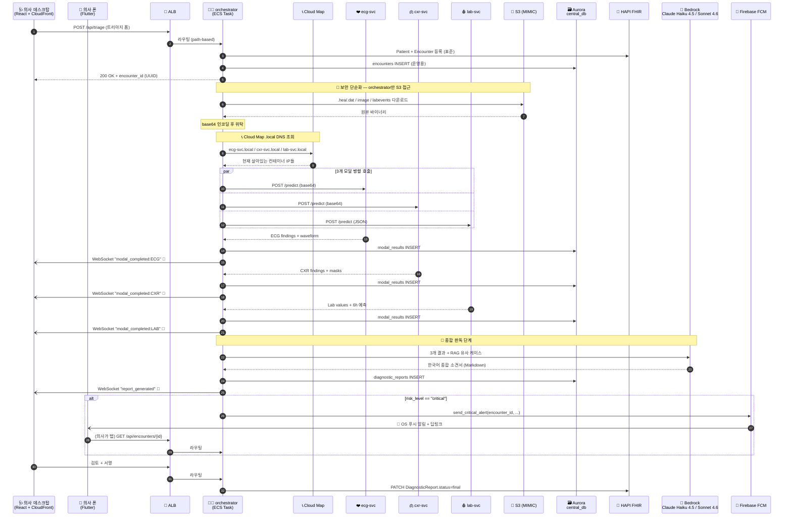

# 🏥 1교시 — 응급실 멀티모달 AI 시스템 아키텍처 개요 (AWS 프로덕션 버전)

> 📚 **과목**: Emergency Multimodal Diagnostic Orchestrator (say-6)
> 👨‍🏫 **담당**: 클라우드 아키텍처 / 의료 IT 융합 과정
> 🎯 **이번 시간 목표**: 환자가 도착한 순간부터 의사 화면 갱신 + 모바일 알림까지의 **AWS 프로덕션 동선**을 머릿속에 영상처럼 그릴 수 있게 만들기

---

## 🌱 들어가며 — 28초의 드라마

```
응급실에 환자가 도착한다.
        ↓  (의사가 트리아지 입력 + 제출 클릭)
       28초가 흐른다
        ↓
의사 데스크탑에 종합 소견서가 자동으로 뜨고,
다른 병동에 있던 당직의 폰에는 "STEMI 의심" 푸시 알림이 뜬다.
```

**이 28초 동안 8개 AWS 서비스 + 8개 시스템 컴포넌트가 어떻게 협력하는지** — 그게 오늘의 전부입니다.

코드는 한 줄도 안 봐도 됩니다. 대신 **"누가 누구한테 뭘 시키나"** 를 응급실 동선처럼 그려보세요. 그게 이해됐다면 80%는 끝난 거예요.

---

## 🎭 1. 등장인물 — 우리 시스템을 응급실에 비유하면

응급실에는 의사, 간호사, 검사실, 의무기록실, 안내데스크, 교환원이 있죠. 우리 시스템도 똑같습니다.

### 1.1 컴포넌트 ↔ 병원 직책 매핑

| 응급실의 누구 / 어디 | 우리 시스템에서는 | 무엇을 하나 |
|--------------------|------------------|-------------|
| 🌐 **병원 안내 키오스크 + 정문 외벽** | **CloudFront + S3** | React 데스크탑 앱(정적 파일)을 전 세계 CDN으로 빠르게 배달 |
| 🩺 **데스크탑 단말의 의사** | **React 웹 프론트엔드** | 트리아지 입력·결과 확인·소견서 서명 |
| 📱 **순회 중인 당직의** | **Flutter 모바일 앱 (`say6_doctor`)** | OS 알림으로 critical 환자 즉시 인지 |
| 🛂 **응급실 정문 안내데스크** | **AWS ALB (Application Load Balancer)** | 들어오는 모든 HTTP/WS 요청을 받아서 어디로 보낼지 분류 |
| 🏥 **응급실 건물 자체** | **ECS Fargate 클러스터 `say2-6team`** | 의료진(컨테이너)들이 일하는 공간. 트래픽 늘면 자동으로 방을 늘림(scale-out) |
| 🧑‍💼 **응급실 과장 (컨트롤 타워)** | **`orchestrator` 서비스** | 환자 등록 → 검사 의뢰 분배 → 결과 종합 → 알림 송출 (모든 지휘) |
| ❤️ **심전도실** | **`ecg-svc`** (12-Lead ONNX) | 심전도 파형 1초 만에 24개 질환 확률 산출 |
| 🫁 **영상의학과** | **`cxr-svc`** (DenseNet + UNet) | 흉부 X-ray 분류 + 폐·심장 윤곽 자동 측정 |
| 🩸 **진단검사의학과** | **`lab-svc`** (룰 + 6h 예측) | 혈액 수치 즉시 해석 + 6시간 후 악화 가능 항목 예측 |
| 📞 **병원 내선 전화 교환원** | **AWS Cloud Map** | "ECG실 부탁해요"라고만 말하면 알아서 현재 ECG실 IP로 연결 |
| 📁 **의무기록실 (국제 표준)** | **HAPI FHIR 서버** | 외부 EMR과 주고받을 수 있는 FHIR R4 표준 기록 보관 |
| 🗃️ **내부 차트장 (우리 병원 전용)** | **Aurora `central_db`** | AI 원본 결과·waveform·이벤트 로그 — 빠른 작업 메모장 |
| 🧠 **베테랑 종합 판독 교수** | **AWS Bedrock — Claude Haiku 4.5 / Sonnet 4.6** | 모달 3개 결과 + 유사 케이스를 보고 한국어 종합 소견서 작성 |
| 📟 **무선 호출기 (삐삐)** | **WebSocket** | 의사 데스크탑에 결과 도착 시 즉시 띵! |
| 🚨 **응급 카톡 알림** | **Firebase FCM** | critical 케이스는 의사 폰에 OS 레벨 푸시 |

### 1.2 직책 계층 한눈에

```
[입구]                       [지휘]                                   [실행 부서]
                                                                ┌─ ❤️ ecg-svc
🌐 CloudFront  ─→  🛂 ALB  ─→   🏥 ECS 클러스터 (say2-6team)   │
   + S3                          ├─ 🧑‍💼 orchestrator         ─┼─ 🫁 cxr-svc
                                 └─ 📁 HAPI FHIR                │
                                                                └─ 🩸 lab-svc
                                                                   (↕ 📞 Cloud Map .local DNS)

[관리 부서 — 별도 운영]
🗃️ Aurora v2  |  🧠 Bedrock Haiku/Sonnet (자동 선택)  |  🚨 FCM  |  📂 S3 (MIMIC)
```

> 💡 **포인트**
> ECS 클러스터 안에는 **여러 ECS Service** 가 있고, 각 Service는 한 종류의 컨테이너(=Task)를 여러 개 굴릴 수 있어요.
> 응급실 건물 안에 ECG실·X-ray실 같은 부서가 따로 있고, 각 부서에 동시에 여러 의료진이 근무할 수 있는 것과 똑같습니다.

---

## 🎬 2. 의사 클릭부터 화면 갱신까지 — 동선 따라가기

자, 한 환자의 28초를 단계별로 쪼개봅시다.

### 🚪 **0초 — 환자 도착, 의사가 트리아지 입력**

```
🩺 의사: "67세 남자, 흉통 30분, 진땀, 호흡곤란"
       └─ 데스크탑 React 앱에 입력 후 [트리아지 제출] 클릭
```

### 🌐 **0.05초 — CloudFront 캐시 우회**

의사가 React 앱을 처음 열 때는 CloudFront(=병원 안내 키오스크)가 S3에서 정적 파일을 가져와 캐싱해뒀어요. 트리아지 제출은 **동적 API 요청**이라 CloudFront는 통과만 시키고 ALB로 직행.

### 🛂 **0.1초 — ALB(안내데스크)가 요청을 받음**

```
React → HTTPS → 🛂 ALB
                  │
                  │  "POST /api/triage 라는 요청이 들어왔네.
                  │   이건 orchestrator 담당이군!"
                  ▼
              🧑‍💼 orchestrator (ECS Task)
```

ALB는 **모든 외부 요청을 가장 먼저 받는 안내데스크**예요. URL 경로(`/api/*`, `/ws/*`)를 보고 어느 ECS Service로 보낼지 결정합니다. 의사 데스크탑·모바일·외부 EMR 어디서 와도 ALB가 일단 받아냄.

### 🧑‍💼 **0.5초 — orchestrator(과장)가 환자 등록 + 검사 의뢰 결정**

orchestrator는 즉시 두 가지를 처리:

```
1️⃣ 환자 등록 — 두 군데에 기록
   ├─ 📁 HAPI FHIR: Patient / Encounter (국제 표준 양식)
   └─ 🗃️ Aurora central_db.encounters: encounter_id (UUID) 발급

2️⃣ ML Decision Engine — 어떤 모달을 부를지 결정
   "이 환자는 chest pain.
    LightGBM 점수: ECG 0.85 / CXR 0.72 / LAB 0.65 → 전부 실행!"
```

```
🩺 의사 ◀── 200 OK + encounter_id ── 🧑‍💼 orchestrator
```

### 📂 **0.6초 — S3에서 MIMIC 원본 다운로드**

orchestrator는 IAM Role을 갖고 있어서 S3에 직접 접근 가능합니다:

```
🧑‍💼 orchestrator → 📂 S3
                       ├─ mimic/ecg/.../{record}.hea  +  .dat   (ECG 12-Lead waveform)
                       ├─ mimic/cxr/.../{study}.png            (흉부 X-ray)
                       └─ mimic/labevents/{subject}.json       (혈액 검사 값)
```

이 시점에서 다음 섹션에서 다룰 **보안 단순화 핵심 패턴**이 등장합니다. ⤵

### 🔐 **0.7초 — Base64 인코딩 + 위탁 전달 준비**

orchestrator는 받아온 바이너리 파일들을 base64 문자열로 인코딩한 뒤 JSON payload에 담습니다:

```json
{
  "patient_id": "P001",
  "patient_info": { "age": 67, "sex": "M" },
  "data": {
    "hea_base64": "SU1JTUlD...",   // .hea 헤더 파일 base64
    "dat_base64": "AAECAwQF..."    // .dat 신호 파일 base64
  }
}
```

### 📞 **0.8초 — Cloud Map 교환원에게 검사실 호출 부탁**

```
orchestrator → 📞 Cloud Map:
   "ecg-svc.local / cxr-svc.local / lab-svc.local 어디에요?"

📞 Cloud Map:
   "ecg-svc.local:8000 → 10.0.2.41 (지금 살아있는 task)
    cxr-svc.local:8000 → 10.0.2.55
    lab-svc.local:8000 → 10.0.2.67"
```

orchestrator는 **IP를 외울 필요가 없어요**. `ecg-svc.local`이라는 **고정 별명**만 부르면 Cloud Map이 현재 살아있는 컨테이너 IP로 자동 변환합니다.

> 💡 **왜 이게 중요할까?**
> ECS는 컨테이너를 수시로 죽이고 새로 만들어요 (배포·스케일링·헬스체크 실패 등). 그때마다 IP가 바뀌는데, 코드에 IP를 박아두면 매번 깨집니다. Cloud Map의 **"서비스 디스커버리"** 가 이 문제를 해결합니다.

### ⚡ **0.9초 — 3개 모달에 동시 발사 (병렬 호출)**

```
시간 ─────────────────────────────────────►
[ ecg-svc /predict — 3초 ]                  ✓ 완료
[ cxr-svc /predict ───── 5초 ]              ✓ 완료
[ lab-svc /predict —— 4초 ]                 ✓ 완료
└─ orchestrator는 가장 늦은 5초만 기다림 ─┘
```

만약 한 곳씩 차례로(직렬) 호출했다면 3+5+4 = **12초**, 병렬이면 **5초**. **7초 절약.**

```python
# 실제 코드 — asyncio.gather()가 마법의 한 줄
ecg_res, cxr_res, lab_res = await asyncio.gather(
    call_ecg(payload),
    call_cxr(payload),
    call_lab(payload),
)
```

### 💚 **각 결과 도착 시점마다 — WebSocket으로 의사 화면에 즉시 푸시**

```
ECG 결과 도착 (3초)  → 🗃️ Aurora INSERT → 📟 WebSocket "modal_completed:ECG" → ECG 카드 갱신
LAB 결과 도착 (4초)  → 🗃️ Aurora INSERT → 📟 WebSocket "modal_completed:LAB" → LAB 카드 갱신
CXR 결과 도착 (5초)  → 🗃️ Aurora INSERT → 📟 WebSocket "modal_completed:CXR" → CXR 카드 갱신
```

의사는 새로고침을 단 한 번도 안 합니다. **결과가 도착하는 족족 자동으로 화면이 바뀝니다.**

이때 화면 상단에는 **🟢 LIVE 뱃지**가 떠 있어서, "지금 실시간 연결되어 있다"는 걸 의사가 시각적으로 확인할 수 있어요.

### 🧠 **5초 — Bedrock Claude Haiku 4.5 / Sonnet 4.6에 종합 판독 의뢰**

3개 결과가 다 도착하면 orchestrator는 그것들을 들고 베테랑 교수에게 갑니다.

```
🧑‍💼: "선생님, 이 세 결과 + RAG로 찾은 유사 케이스 5건 보시고 종합 소견 작성해주세요."

🧠 Claude Haiku 4.5 / Sonnet 4.6 (Bedrock):
   "ECG ST 분절 상승 + CXR 폐부종 + BNP 12,462 → STEMI + 급성 심부전 의증.
    추가 검사: CT 관상동맥 / Echocardiography
    처치: 산소 / 니트로글리세린 / 항혈소판제 / 헤파린 ..."
```

Bedrock은 약 **8초** 걸려서 한국어 의사용 종합 소견서를 마크다운 형식으로 작성합니다.

### 🚨 **13초 — critical이면 모바일에도 알림 송출**

종합 소견의 `risk_level=critical`이면 orchestrator는 추가로:

```
🚨 FCM 디스패처:
   1️⃣ 🗃️ Aurora device_tokens에서 활성 토큰 목록 조회
   2️⃣ Firebase Admin SDK로 multicast 발송
   3️⃣ Firebase가 APNs / FCM 게이트웨이를 거쳐
   4️⃣ 의사 폰 OS에 알림 표시 → "🚨 긴급: STEMI 의심 — 67세 남자"
```

화면이 꺼진 폰에도 알림 + 진동이 옵니다. **의사가 앱을 안 보고 있어도 즉시 인지 가능.**

### ✍️ **13~28초 — 의사 검토 + 서명**

```
🩺 의사: 종합 소견서 검토 → 한 줄 수정 → [서명] 클릭
        └─ orchestrator → HAPI FHIR DiagnosticReport.status=final 변경
```

한 환자의 동선 완료. 외부 EMR과 호환 가능한 FHIR R4 표준 기록이 의무기록실(HAPI)에 남습니다.

---

## 🔐 3. 보안 단순화의 핵심 — "Base64 위탁 다운로드" 패러다임

여기가 오늘 수업에서 가장 깊이 이해해야 할 부분입니다.

### 🤔 평범한 설계라면 어떻게 했을까?

대부분의 멀티 서비스 시스템은 이렇게 합니다:

```
❌ 나쁜 설계 — 모든 모달이 직접 S3 접근
                       ┌─ AWS 키 🔑 ─→ S3 (.hea/.dat 다운로드)
ecg-svc    🔑 ────────┤
cxr-svc    🔑 ────────┤    각자 S3 접근 권한 필요
lab-svc    🔑 ────────┤    → 각자 IAM Role / Access Key 관리
orchestrator 🔑 ──────┘
```

이 구조의 **보안 부담**:
- 컨테이너 4개 × 각자 IAM Role 발급·관리 = **4배의 보안 관리 비용**
- 모달이 운영 중 해킹당하면 → AWS 키 유출 → S3 전체 데이터 노출
- 키 회전(rotation) 시 4개 컨테이너 모두 재배포

### ✅ 우리 설계 — orchestrator만 S3 접근

```
✅ Base64 위탁 다운로드 패턴
                                                     (모달은 AWS 키 X)
                          orchestrator               ┌─ ecg-svc
                            🔑                       │
S3 ──.hea/.dat──→ orchestrator ──base64──→ /predict ┼─ cxr-svc
                  (인코딩+위탁)                       │
                                                     └─ lab-svc
```

**과정**:
1. orchestrator만 IAM Role을 갖고 S3에서 원본 다운로드
2. 바이너리 파일을 base64 문자열로 인코딩
3. JSON payload 안에 담아서 모달 `/predict` 엔드포인트로 POST
4. 모달은 받은 base64를 디코딩해서 추론만 수행 → **S3 접근 불필요**

### 🛡️ 보안적 이점 4가지

| 이점 | 설명 |
|------|------|
| **공격면 최소화** | 외부 노출되는 모달이 해킹돼도 AWS 자격증명이 거기엔 없음 → S3 안전 |
| **권한 1개로 통일** | IAM Role을 orchestrator 하나에만 부여 → 관리 비용 1/4 |
| **키 회전 단순** | 키 바뀌어도 orchestrator만 재배포, 모달들은 무영향 |
| **감사 추적 용이** | S3 접근 로그가 orchestrator 한 곳에서만 발생 → CloudTrail 분석 간단 |

### 🏥 병원 비유로 한 번 더

```
❌ 나쁜 설계
   영상의학과·심전도실·진단검사실 각각이 병원 금고 키를 갖고 다님
   → 어디서 떨어뜨릴지 모름, 사고 나면 금고 통째로 위험

✅ 우리 설계
   응급실 과장만 금고 키를 갖고 있고, 각 검사실엔 환자 자료만 들고 가서 전달
   → 검사실에서 사고가 나도 금고는 안 털림
```

> 💡 **보안 원칙: Least Privilege (최소 권한 원칙)**
> "필요한 권한만, 필요한 곳에만" — 우리 시스템은 이 원칙을 base64 위탁 패턴으로 구현합니다.
> AWS Well-Architected Framework의 Security Pillar 핵심 가이드라인이고, 시험에 자주 나옵니다.

### 📏 실측 — 추가 비용은 얼마?

base64 인코딩은 **데이터 크기를 약 33% 늘립니다**. ECG `.dat` 파일이 120KB라면 base64 후 160KB. 네트워크 1번 더 거치므로 약 50~100ms 추가. **얻은 보안 이점에 비하면 무시할 수준.**

---

## 📊 4. 한눈에 보는 시퀀스 다이어그램 (복습용)

전체 흐름을 시간 순서로 정리한 Mermaid 다이어그램입니다.



> 🔍 **다이어그램 읽는 팁**
> - `-->>` (실선·점선) = 동기 응답 (요청자가 기다림)
> - `-)` (열린 화살표 + 점선) = 비동기 푸시 (서버가 클라이언트에 발사)
> - `par ... and ... end` 블록 = 동시 실행 (병렬)
> - `alt ... end` = 조건 분기 (critical일 때만)

---

## 🧪 5. 동기 vs 비동기 — 왜 모달을 병렬로 호출해야 하나?

### 🥢 동기 (Synchronous) = 학식 한 줄 서기

```
🧑 → 🧑 → 🧑 → 🍱
```
앞 사람 끝나야 다음 사람 시작. **단순하지만 느림.**

### ☕ 비동기 (Asynchronous) = 스벅 진동벨

```
주문 3개 동시 발사 → 바리스타 3명 동시 작업 → 진동벨로 알림
```
서로 안 기다리고 동시에. **빠르지만 "끝났는지" 알리는 신호가 필요** (=WebSocket).

### ⏱️ 시간 계산 — 7초 차이의 의미

```
직렬:  [ECG: 3초] → [CXR: 5초] → [LAB: 4초]  =  12초
병렬:  [ECG: 3초]                          ┐
       [CXR: 5초]  ◀ 가장 느린 모달 기준    ├─ 5초
       [LAB: 4초]                          ┘
```

> 🏥 **Time is Muscle**
> 심근경색에서 막힌 혈관을 뚫는 시간이 **30분 늦어질 때마다 1년 생존율 7.5% 하락**.
> AI가 7초 빨리 분류하면 의사는 7초 빨리 결정하고, 환자는 7초 빨리 시술실로 갑니다.

---

## 🎯 6. 한 페이지 요약 — 친구한테 설명하기

오늘 수업이 끝나면 친구한테 이 5문장만 말해도 시스템 설명 끝나야 합니다.

```
1. 의사가 React(CloudFront로 배달) 화면에서 트리아지를 제출하면
   ALB가 받아서 ECS 클러스터(say2-6team) 안의 orchestrator로 보낸다.

2. orchestrator는 환자를 HAPI FHIR(표준 의무기록)와 Aurora central_db(우리 메모장)
   양쪽에 기록하고 encounter_id를 발급한다.

3. orchestrator만 S3에서 원본을 받아 base64로 인코딩한 뒤,
   Cloud Map .local DNS로 ecg/cxr/lab 3개 모달에 병렬로 보낸다.
   (모달은 AWS 키 없음 → 보안 단순화 = Least Privilege)

4. 모달 결과가 도착할 때마다 WebSocket으로 의사 데스크탑 화면이 자동 갱신되고,
   3개가 다 모이면 Bedrock Claude Haiku 4.5 / Sonnet 4.6이 한국어 종합 소견서를 작성한다.

5. risk_level=critical이면 Firebase FCM으로 의사 모바일에 OS 푸시 알림이 가고,
   탭하면 해당 환자 상세 페이지로 딥링크 이동한다.
```

---

## 📝 7. 쪽지 시험 (5분)

종이 한 장씩 꺼내세요. 정답은 아래에서 펼쳐보세요.

**Q1.** orchestrator만 S3 접근 권한을 갖고 모달 3개는 안 갖는 설계의 보안 이점을 2가지 이상 쓰시오.

**Q2.** 만약 cxr-svc 컨테이너가 갑자기 죽으면 (한 모달 다운), 우리 시스템은 어떻게 동작해야 이상적인가? 한 문장으로.

**Q3.** Cloud Map의 역할을 "한 단어 비유"로 표현하시오.

**Q4.** 의사 폰이 화면이 꺼진 상태에서도 critical 알림이 뜨려면 WebSocket으로 불가능하고 FCM이 필요한 이유를 설명하시오.

**Q5.** 3개 모달을 직렬로 호출하면 평균 응답 시간은 어떻게 바뀌고, 왜 그렇게 되나?

**Q6.** ALB는 응급실의 어느 위치에 비유했나? 그 비유에서 ALB가 하는 핵심 역할은?

---

<details>
<summary>✅ 정답 펼치기</summary>

**A1.** ① 모달이 해킹돼도 AWS 자격증명 유출 없음 (공격면 최소화) ② IAM Role 1개만 관리하면 됨 ③ 키 회전 시 orchestrator만 재배포 ④ S3 접근 로그가 한 곳에서만 발생해 감사·디버깅 용이.

**A2.** 이상적으로는 **CXR만 실패로 표시되고 ECG·LAB·종합소견은 정상 진행**되어야 함 (graceful degradation). 단일 장애점(SPOF) 회피.

**A3.** "교환원" 또는 "전화번호부" — 컨테이너 IP가 바뀌어도 이름(`ecg-svc.local`)으로 찾을 수 있게 해주는 중계자.

**A4.** WebSocket은 앱이 포어그라운드(화면 켜진 상태)에 있어야 연결 유지됨. 화면 끄면 OS가 백그라운드 연결을 끊음 → 알림 못 받음. FCM은 OS 레벨 푸시 게이트웨이를 통해 앱이 죽어있어도 알림 전달.

**A5.** **12초 (3+5+4)** 로 증가. 한 모달이 끝나야 다음을 시작하므로 응답 시간이 모달들의 **합**이 됨. 병렬은 **최댓값(5초)** 만 기다리면 됨.

**A6.** **응급실 정문 안내데스크**. 들어오는 모든 요청을 일단 받아서 URL 경로를 보고 어느 부서(ECS Service)로 보낼지 분류하는 역할.

</details>

---

## 🔮 8. 다음 시간 예고 — 2교시

> **"왜 DB가 두 개야? HAPI FHIR vs Aurora central_db — 의무기록실과 작업 메모장의 분업"**
>
> 오늘 흘려 들으셨던 "표준 양식 vs 운영 양식"의 차이를 깊이 파봅니다. 실제 SQL 스키마도 같이 뜯어보고, **FHIR R4 리소스 구조**도 살짝 맛볼 거예요.

---

## 📚 더 읽어볼 거리

| 자료 | 무엇을 배우나 |
|------|-------------|
| [AWS ECS Fargate 공식 문서](https://docs.aws.amazon.com/AmazonECS/latest/developerguide/AWS_Fargate.html) | "Task definition", "Service", "Cluster" 개념 |
| [AWS Cloud Map](https://docs.aws.amazon.com/cloud-map/) | 서비스 디스커버리의 표준 패턴 |
| [AWS Well-Architected — Security Pillar](https://docs.aws.amazon.com/wellarchitected/latest/security-pillar/welcome.html) | Least Privilege 등 보안 원칙 |
| [Python `asyncio.gather`](https://docs.python.org/3/library/asyncio-task.html#asyncio.gather) | 병렬 호출의 한 줄 구현 |
| [WebSocket vs Polling vs SSE](https://ably.com/topic/websockets-vs-sse) | 실시간 통신 3대장 비교 |
| [Firebase FCM 아키텍처](https://firebase.google.com/docs/cloud-messaging/concept-options) | 모바일 푸시 게이트웨이 |
| [Anthropic Claude Haiku 4.5 / Sonnet 4.6](https://www.anthropic.com/claude) | 우리가 쓰는 LLM의 능력 |

---

> 👨‍🏫 **마지막 한마디**
> 오늘 다룬 8개 컴포넌트는 그 자체로도 책 한 권씩 나오는 주제예요.
> 그 책 1쪽도 못 본 채로 일단 **"전체 그림"** 부터 잡았다는 게 오늘의 성과입니다.
>
> 다음 시간엔 이 그림의 한 부분을 줌인해서 들여다볼 거예요.
> 질문 있으면 `#emergency-ai` 슬랙 채널에 남기세요. 수고 많았습니다 🩺
